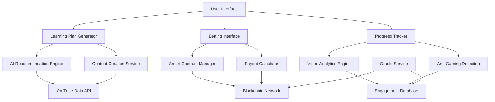

# Design Document

## Overview

The Gamified Learning Platform transforms traditional online education into an engaging, high-stakes experience where users bet on their own success. By combining AI-powered personalization, blockchain smart contracts, and sophisticated anti-gaming measures, the platform creates a unique ecosystem that maximizes learning commitment and outcomes.

## Demo Mode Implementation

**IMPORTANT: For hackathon and development phases, this system operates in DEMO MODE with:**

- **Virtual Currency Only**: All betting uses simulated tokens/coins with no real monetary value
- **Mock Blockchain**: Smart contracts are simulated without actual blockchain transactions
- **Demo Wallets**: Users interact with fake wallet interfaces for demonstration purposes
- **Simulated Payouts**: All rewards and penalties are virtual for testing and demonstration
- **No Real Money**: Zero financial risk during development and testing phases
- **Full Functionality Demo**: All features work exactly as they would with real money, but safely simulated

This allows complete testing and demonstration of the innovative gamification mechanics without any financial risk during development.

## Architecture

### High-Level Architecture



### Core System Components

1. **AI Learning Plan Generator** - Creates personalized learning paths
2. **Blockchain Betting System** - Manages stakes and payouts via smart contracts
3. **Intelligent Progress Tracker** - Monitors genuine learning engagement
4. **Content Curation Engine** - Finds and ranks educational content
5. **Anti-Gaming Detection** - Prevents system manipulation
6. **Dynamic Payout Calculator** - Determines fair reward multipliers

## Components and Interfaces

### 1. AI Learning Plan Generator

**Purpose:** Create personalized, adaptive learning plans based on skill gaps and user preferences

**Key Methods:**
- `generateLearningPlan(userProfile, jobRequirements, timeline, customPreferences)` - Main plan creation
- `adaptPlanDifficulty(plan, timeline)` - Adjust content based on chosen duration
- `recalculatePlan(planId, newTimeline)` - Dynamic plan adjustment
- `validateCustomPath(userSelectedContent, learningObjectives)` - Verify user-curated paths

**AI Integration:**
- Uses OpenRouter's models for content analysis and recommendation
- Analyzes YouTube video transcripts for difficulty assessment
- Learns from user completion patterns to improve recommendations
- Integrates with resume analysis for precise skill gap identification

**Plan Structure:**
```javascript
{
  id: string,
  userId: string,
  jobTargetId: string,
  timeline: number, // weeks
  difficultyScore: number, // 1-10
  skillGaps: SkillGap[],
  learningPath: LearningModule[],
  milestones: Milestone[],
  payoutMultiplier: number,
  customizations: UserCustomization[],
  createdAt: Date,
  updatedAt: Date
}
```

### 2. Simulated Blockchain Betting System (Demo Mode)

**Purpose:** Demonstrate learning bet management through simulated smart contracts without real transactions

**Mock Smart Contract Functions:**
- `simulatePlaceLearningBet(planId, virtualStakeAmount, timeline, payoutMultiplier)` - Lock virtual funds
- `simulateVerifyMilestone(planId, milestoneId, completionProof)` - Validate progress with demo verification
- `simulateExecutePayout(planId, completionStatus)` - Automatic virtual reward distribution
- `simulateHandleDispute(planId, evidenceHash)` - Manage completion disputes in demo mode

**Demo Blockchain Integration:**
- Simulates Ethereum, Polygon, and Binance Smart Chain interfaces
- Uses mock oracles for external data verification demonstration
- Implements simulated multi-signature wallets for platform fund management demo
- Includes demo emergency pause mechanisms for security demonstration

**Demo Betting Data Model:**
```javascript
{
  betId: string,
  userId: string,
  planId: string,
  virtualStakeAmount: number, // Virtual currency for demo
  demoMode: true, // Flag indicating this is a simulation
  simulatedCryptocurrency: string, // Demo currency type
  timeline: number,
  payoutMultiplier: number,
  milestones: BettingMilestone[],
  status: 'active' | 'completed' | 'failed' | 'disputed',
  mockSmartContractAddress: string, // Simulated contract address
  simulatedTransactionHashes: string[], // Demo transaction IDs
  createdAt: Date
}
```

### 3. Intelligent Progress Tracker

**Purpose:** Monitor genuine learning engagement and prevent gaming

**Key Methods:**
- `trackVideoEngagement(userId, videoId, engagementMetrics)` - Monitor viewing behavior
- `analyzeViewingPattern(userId, sessionData)` - Detect authentic learning
- `validateCompletion(userId, contentId, completionCriteria)` - Verify genuine completion
- `generateComprehensionQuiz(videoContent, difficulty)` - Create verification tests
- `detectGamingAttempts(userId, behaviorPattern)` - Identify cheating attempts

**Engagement Metrics:**
```javascript
{
  videoId: string,
  userId: string,
  totalWatchTime: number,
  actualDuration: number,
  pauseCount: number,
  seekCount: number,
  averageSeekDistance: number,
  tabFocusTime: number,
  mouseMovements: number,
  volumeChanges: number,
  playbackSpeedChanges: number,
  comprehensionScore: number,
  suspiciousActivityFlags: string[],
  timestamp: Date
}
```

### 4. Content Curation Engine

**Purpose:** Find, rank, and organize educational content from multiple sources

**Key Methods:**
- `searchEducationalContent(skillKeywords, difficulty, duration)` - Find relevant content
- `rankContentByQuality(contentList, userPreferences)` - Score and sort content
- `analyzeContentDifficulty(videoTranscript, metadata)` - Assess learning complexity
- `generateContentAlternatives(originalContent, learningObjective)` - Provide options
- `trackContentPerformance(contentId, userCompletionData)` - Monitor effectiveness

**Content Ranking Factors:**
- Video quality and production value
- Instructor credibility and expertise
- User ratings and completion rates
- Content freshness and relevance
- Alignment with learning objectives
- Difficulty progression appropriateness

### 5. Dynamic Payout Calculator

**Purpose:** Calculate fair and motivating reward multipliers

**Key Methods:**
- `calculateBaseMultiplier(timeline, contentDifficulty, userSkillLevel)` - Base payout calculation
- `adjustForMarketConditions(baseMultiplier, platformMetrics)` - Market-based adjustments
- `applyRiskFactors(multiplier, userHistory, contentType)` - Risk-based modifications
- `validatePayoutSustainability(proposedPayout, platformReserves)` - Ensure platform viability

**Payout Calculation Formula:**
```
Payout Multiplier = Base Multiplier × Timeline Compression Factor × Difficulty Bonus × User Risk Factor × Market Adjustment

Where:
- Base Multiplier: 1.1 - 1.5 (platform standard)
- Timeline Compression: 1.0 - 3.0 (based on aggressive timeline choice)
- Difficulty Bonus: 1.0 - 2.0 (based on content complexity)
- User Risk Factor: 0.8 - 1.2 (based on historical performance)
- Market Adjustment: 0.9 - 1.1 (based on platform economics)
```

## Data Models

### Learning Plan Model
```javascript
{
  id: string,
  userId: string,
  jobTitle: string,
  targetCompany: string,
  skillGaps: [
    {
      skill: string,
      currentLevel: number, // 0-10
      targetLevel: number, // 0-10
      priority: 'critical' | 'important' | 'nice-to-have',
      estimatedHours: number
    }
  ],
  learningModules: [
    {
      id: string,
      title: string,
      description: string,
      skillsAddressed: string[],
      content: [
        {
          type: 'video' | 'article' | 'practice' | 'quiz',
          title: string,
          url: string,
          duration: number,
          difficulty: number, // 1-10
          prerequisites: string[],
          completionCriteria: {
            minWatchPercentage: number,
            comprehensionThreshold: number,
            practiceRequirements: string[]
          }
        }
      ],
      estimatedCompletionTime: number,
      milestone: boolean
    }
  ],
  timeline: {
    totalWeeks: number,
    weeklySchedule: [
      {
        week: number,
        modules: string[],
        estimatedHours: number,
        milestones: string[]
      }
    ]
  },
  betting: {
    enabled: boolean,
    stakeAmount: number,
    payoutMultiplier: number,
    milestoneRewards: number[]
  },
  customizations: {
    userSelectedContent: string[],
    preferredLearningStyle: string,
    availableHoursPerWeek: number,
    difficultyPreference: string
  }
}
```

### User Progress Model
```javascript
{
  userId: string,
  planId: string,
  overallProgress: {
    completionPercentage: number,
    currentWeek: number,
    milestonesAchieved: number,
    totalMilestones: number,
    onTrackForCompletion: boolean,
    projectedCompletionDate: Date
  },
  moduleProgress: [
    {
      moduleId: string,
      status: 'not_started' | 'in_progress' | 'completed',
      completionPercentage: number,
      timeSpent: number,
      contentProgress: [
        {
          contentId: string,
          status: 'not_started' | 'in_progress' | 'completed',
          engagementScore: number,
          comprehensionScore: number,
          completedAt: Date,
          verificationPassed: boolean
        }
      ]
    }
  ],
  engagementMetrics: {
    totalStudyTime: number,
    averageSessionLength: number,
    consistencyScore: number, // based on regular study patterns
    engagementTrend: 'improving' | 'stable' | 'declining',
    gamingAttempts: number,
    verificationFailures: number
  },
  betting: {
    activeBets: BettingRecord[],
    totalStaked: number,
    totalWon: number,
    successRate: number,
    riskProfile: 'conservative' | 'moderate' | 'aggressive'
  }
}
```

## Error Handling

### Smart Contract Error Handling
- **Transaction Failures:** Automatic retry with gas price adjustment
- **Oracle Failures:** Fallback to manual verification with dispute resolution
- **Network Congestion:** Queue transactions with user notification
- **Insufficient Funds:** Clear error messages with funding instructions

### Anti-Gaming Error Handling
- **False Positives:** Appeal process with human review
- **Detection Failures:** Continuous ML model improvement
- **User Disputes:** Transparent evidence review process
- **System Manipulation:** Immediate account suspension with investigation

### Content Delivery Error Handling
- **Video Unavailability:** Automatic replacement with equivalent content
- **API Rate Limits:** Intelligent caching and request distribution
- **Quality Issues:** User reporting system with rapid content replacement
- **Accessibility Problems:** Alternative format provision

## Testing Strategy

### Smart Contract Testing
- **Unit Tests:** Test all contract functions with edge cases
- **Integration Tests:** Test oracle integration and cross-chain functionality
- **Security Audits:** Professional third-party security reviews
- **Testnet Deployment:** Extensive testing on blockchain testnets

### Anti-Gaming Testing
- **Behavioral Simulation:** Test with various gaming attempt patterns
- **Machine Learning Validation:** Validate detection models with known gaming data
- **User Experience Testing:** Ensure legitimate users aren't falsely flagged
- **Performance Testing:** Test detection systems under high load

### End-to-End Testing
- **Complete Learning Journeys:** Test full user workflows from plan creation to payout
- **Multi-User Scenarios:** Test concurrent users with various betting patterns
- **Failure Recovery:** Test system behavior during various failure modes
- **Cross-Platform Testing:** Ensure functionality across different devices and browsers

## Security Considerations

### Blockchain Security
- **Smart Contract Audits:** Regular security reviews by certified auditors
- **Multi-Signature Wallets:** Require multiple approvals for large transactions
- **Emergency Pause Mechanisms:** Ability to halt operations during security incidents
- **Upgrade Patterns:** Secure contract upgrade mechanisms with governance

### Data Protection
- **User Privacy:** Encrypt sensitive learning data and betting information
- **GDPR Compliance:** Implement right to deletion and data portability
- **Financial Data Security:** PCI DSS compliance for payment processing
- **Behavioral Data Protection:** Anonymize engagement tracking data

### Anti-Gaming Security
- **Behavioral Biometrics:** Advanced user behavior analysis
- **Device Fingerprinting:** Detect multiple account usage
- **IP Monitoring:** Identify suspicious access patterns
- **Machine Learning Security:** Protect ML models from adversarial attacks

## Scalability Considerations

### Blockchain Scalability
- **Layer 2 Solutions:** Implement Polygon or Arbitrum for lower fees
- **Batch Processing:** Group multiple transactions for efficiency
- **State Channels:** Use for frequent micro-transactions
- **Cross-Chain Compatibility:** Support multiple blockchain networks

### Content Delivery Scalability
- **CDN Integration:** Global content delivery for video streaming
- **Caching Strategies:** Intelligent caching of popular educational content
- **API Rate Management:** Efficient YouTube API usage with caching
- **Database Optimization:** Optimized queries for user progress tracking

### User Experience Scalability
- **Progressive Web App:** Offline capability and fast loading
- **Mobile Optimization:** Native mobile app for better engagement tracking
- **Real-Time Updates:** WebSocket connections for live progress updates
- **Personalization at Scale:** Efficient recommendation algorithms