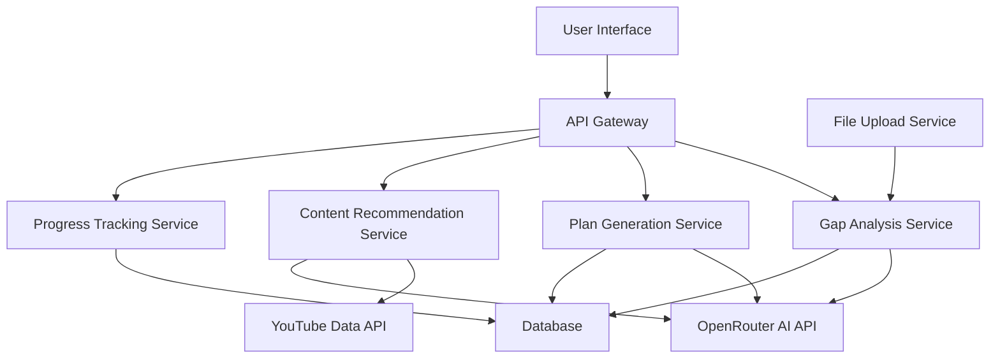

# Design Document

## Overview

The intelligent AI-powered preparation plan creation system will analyze resume-job description gaps and generate personalized, adaptive learning plans with dynamic content recommendations. The system uses OpenRouter's free AI models for analysis and the YouTube Data API for content discovery.

## Architecture

### High-Level Architecture



### Service Architecture

The system follows a microservices pattern with the following core services:

1. **Gap Analysis Service** - Analyzes resume vs job description differences
2. **Plan Generation Service** - Creates adaptive learning plans based on timeframe
3. **Content Recommendation Service** - Finds relevant YouTube videos and resources
4. **Progress Tracking Service** - Monitors video viewing progress and engagement
5. **File Upload Service** - Handles resume and job description uploads

## Components and Interfaces

### 1. Gap Analysis Service

**Purpose:** Extract skills from documents and identify gaps

**Key Methods:**
- `analyzeDocuments(resume, jobDescription)` - Main analysis entry point
- `extractSkills(document)` - Extract skills using AI parsing
- `categorizeGaps(gaps)` - Prioritize gaps (critical, important, nice-to-have)
- `identifySkillTypes(skills)` - Classify as technical/soft skills

**AI Integration:**
- Uses OpenRouter's `meta-llama/llama-3.2-3b-instruct:free` model
- Structured prompts for skill extraction and gap analysis
- Fallback to template-based analysis if AI fails

### 2. Plan Generation Service

**Purpose:** Create adaptive learning plans based on timeframe and gaps

**Key Methods:**
- `generatePlan(gaps, duration, userPreferences)` - Main plan creation
- `adaptPlanDuration(plan, newDuration)` - Dynamic plan adjustment
- `createMilestones(plan, duration)` - Generate weekly checkpoints
- `calculateTimeAllocations(gaps, duration)` - Distribute learning time

**Plan Structure:**
```javascript
{
  id: string,
  userId: string,
  duration: number, // in months
  gaps: Gap[],
  milestones: Milestone[],
  totalEstimatedHours: number,
  createdAt: Date,
  updatedAt: Date
}
```

### 3. Content Recommendation Service

**Purpose:** Find and organize relevant learning content

**Key Methods:**
- `recommendContent(gaps, duration, learningStyle)` - Main recommendation engine
- `searchYouTubeVideos(skill, duration, difficulty)` - YouTube API integration
- `createPlaylists(content, objectives)` - Organize content by learning goals
- `validateContentQuality(videos)` - Filter high-quality content

**YouTube Integration:**
- Uses existing YouTube Data API v3 key for video search
- Filters by duration (short videos for 1-month, longer for 3-month plans)
- Prioritizes recent, high-rated educational content
- Backup content sources for API failures

### 4. Progress Tracking Service

**Purpose:** Monitor learning progress and adapt recommendations

**Key Methods:**
- `trackVideoProgress(userId, videoId, watchTime, totalDuration)` - Track viewing
- `validateCompletion(watchTime, totalDuration)` - Check 75% completion rule
- `analyzeEngagementPatterns(userId)` - Detect skipping behavior
- `adaptRecommendations(userId, engagementData)` - Adjust content based on patterns

**Progress Data Model:**
```javascript
{
  userId: string,
  videoId: string,
  watchTime: number,
  totalDuration: number,
  completionPercentage: number,
  isCompleted: boolean,
  engagementScore: number,
  lastWatched: Date
}
```

## Data Models

### Gap Model
```javascript
{
  id: string,
  skill: string,
  category: 'technical' | 'soft' | 'experience',
  priority: 'critical' | 'important' | 'nice-to-have',
  currentLevel: number, // 0-10 scale
  requiredLevel: number, // 0-10 scale
  gapSize: number,
  learningPath: string[]
}
```

### Learning Plan Model
```javascript
{
  id: string,
  userId: string,
  jobTitle: string,
  duration: number,
  gaps: Gap[],
  content: ContentItem[],
  milestones: Milestone[],
  progress: {
    completedItems: number,
    totalItems: number,
    completionPercentage: number,
    estimatedTimeRemaining: number
  },
  adaptations: Adaptation[]
}
```

### Content Item Model
```javascript
{
  id: string,
  type: 'video' | 'article' | 'course' | 'practice',
  title: string,
  url: string,
  duration: number,
  difficulty: 'beginner' | 'intermediate' | 'advanced',
  skills: string[],
  estimatedCompletionTime: number,
  quality: {
    rating: number,
    views: number,
    uploadDate: Date
  }
}
```

## Error Handling

### AI Service Error Handling
- **Timeout Handling:** 30-second timeout with exponential backoff retry (3 attempts)
- **Rate Limiting:** Implement request queuing for API limits
- **Fallback Strategy:** Template-based responses when AI services fail
- **Response Validation:** Structured parsing with error recovery

### YouTube API Error Handling
- **Quota Exceeded:** Cache popular content and use backup sources
- **Invalid Responses:** Content validation and filtering
- **Network Failures:** Retry logic with cached recommendations

### Data Validation
- **Input Sanitization:** Validate all user inputs and file uploads
- **Content Filtering:** Remove inappropriate or low-quality content
- **Progress Validation:** Ensure tracking data integrity

## Testing Strategy

### Unit Testing
- **Service Layer:** Test each service method independently
- **AI Integration:** Mock AI responses for consistent testing
- **Data Models:** Validate model constraints and relationships
- **Error Scenarios:** Test all error handling paths

### Integration Testing
- **API Endpoints:** Test complete request/response cycles
- **External Services:** Test OpenRouter and YouTube API integration
- **Database Operations:** Test data persistence and retrieval
- **File Upload:** Test resume and job description processing

### End-to-End Testing
- **Complete Workflows:** Test full prep plan creation process
- **Progress Tracking:** Test video watching and completion detection
- **Plan Adaptation:** Test dynamic plan adjustments
- **Error Recovery:** Test system behavior during service failures

### Performance Testing
- **AI Response Times:** Ensure acceptable latency for plan generation
- **Content Loading:** Test YouTube video search performance
- **Database Queries:** Optimize progress tracking queries
- **Concurrent Users:** Test system under load

## Security Considerations

### API Key Management
- Use existing YouTube Data API key from environment
- Store OpenRouter API key in environment variables
- Implement key rotation procedures
- Monitor API usage and costs

### Data Protection
- Encrypt sensitive user data (resumes, progress)
- Implement proper access controls
- Secure file upload validation

### Input Validation
- Sanitize all user inputs
- Validate file uploads (type, size, content)
- Prevent injection attacks in AI prompts
## UI
 Integration Strategy

### Existing UI Preservation
- **Non-Destructive Approach:** All new features will be added as enhancements to existing components
- **Backward Compatibility:** Existing functionality remains unchanged
- **Progressive Enhancement:** New prep plan features integrate seamlessly with current workflows

### UI Enhancement Areas
1. **Resume Upload Enhancement:** Add gap analysis trigger to existing resume upload
2. **Job Application Enhancement:** Add prep plan generation option to job application flow
3. **Dashboard Addition:** New prep plan section added to existing user dashboard
4. **Progress Tracking Widget:** New component for video progress monitoring
5. **Plan Management Panel:** New section for viewing and managing preparation plans

### Component Integration Points
- Extend existing file upload components for resume/job description analysis
- Add new prep plan cards to existing dashboard layout
- Integrate video progress tracking with existing video player components
- Add plan duration selector to existing form components
- Enhance existing navigation with prep plan menu items

### Data Flow Integration
- Leverage existing user authentication and session management
- Use existing database connections and models where applicable
- Extend existing API routes with new prep plan endpoints
- Maintain existing data validation and security patterns